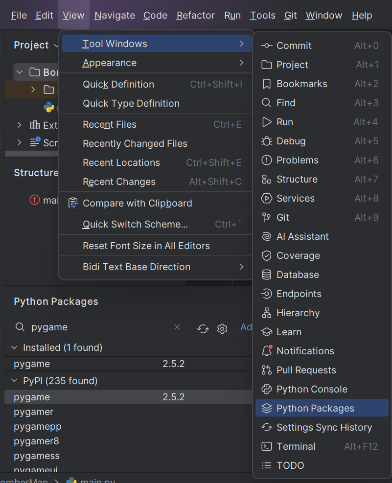
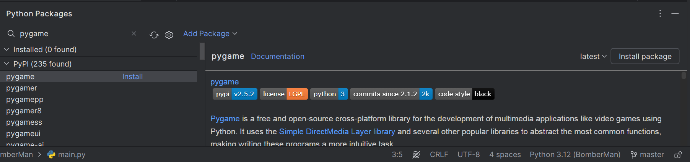

# Dự án Game Bomberman

## Mục lục
- [Lời giới thiệu](#lời-giới-thiệu)
- [Lịch sử phát triển của Bomberman](#lịch-sử-phát-triển-của-bomberman)
- [Mục tiêu của dự án](#mục-tiêu-của-dự-án)
- [Phạm vi của dự án](#phạm-vi-của-dự-án)
- [Kế hoạch triển khai](#kế-hoạch-triển-khai)
- [Cách chạy game](#cách-chạy-game)
- [Đóng góp](#đóng-góp)
- [Giấy phép](#giấy-phép)

## Lời giới thiệu
Chào mừng bạn đến với Dự án Game Bomberman! Dự án này nhằm phát triển một game Bomberman nhiều người chơi sử dụng Python và các thư viện khác nhau. Mục tiêu là cung cấp một hướng dẫn toàn diện và triển khai việc xây dựng một game Bomberman mang lại sự giải trí và trải nghiệm phát triển đầy thử thách.

Trong README này, chúng tôi sẽ giới thiệu về dự án, cung cấp bối cảnh lịch sử của Bomberman, nêu rõ các mục tiêu phát triển của chúng tôi và chi tiết kế hoạch triển khai. Chúng tôi hy vọng dự án này sẽ truyền cảm hứng cho bạn và cung cấp những hiểu biết quý giá về phát triển game.

## Lịch sử phát triển của Bomberman

### Bomberman - Huyền thoại game đặt bom với hành trình bùng nổ
Bomberman là một trò chơi đặt bom huyền thoại đã đồng hành cùng tuổi thơ của nhiều thế hệ game thủ. Khởi nguồn từ Nhật Bản, Bomberman đã trải qua một hành trình phát triển đầy ấn tượng, ghi dấu ấn sâu đậm trong lòng người hâm mộ.

### 1983 - Khởi đầu cho huyền thoại
Năm 1983, Hudson Soft ra mắt Bomberman trên hệ máy MSX. Trò chơi nhanh chóng thu hút sự chú ý bởi lối chơi đơn giản nhưng hấp dẫn: điều khiển nhân vật để đặt bom, phá hủy chướng ngại vật và tiêu diệt kẻ thù.

### 1985 - 1990 - Bùng nổ và lan tỏa
Bomberman tiếp tục phát triển mạnh mẽ, trở thành "bom tấn" trên các hệ máy NES, SNES, Sega Genesis và nhiều hệ máy khác. Phiên bản này nổi bật với nhiều chế độ chơi đa dạng, kho vũ khí phong phú và các màn chơi đầy thử thách.

### 1997 - Bomberman 64 - Bước tiến đột phá
Năm 1997, Bomberman 64 đánh dấu một bước ngoặt lịch sử khi chuyển sang góc nhìn 3D ấn tượng. Bomberman 64 mở ra một kỷ nguyên mới cho series, với đồ họa đẹp mắt và lối chơi hấp dẫn, thu hút đông đảo người chơi.

### 1999 - Bomberman Online - Kỷ nguyên kết nối
Bomberman Online ra mắt trên hệ máy Sega Dreamcast, mang đến trải nghiệm chơi game trực tuyến mới mẻ. Người chơi có thể so tài cùng bạn bè trên nhiều bản đồ khác nhau, tạo nên bầu không khí sôi động và náo nhiệt.

### 2000 - nay - Bomberman đa nền tảng
Trò chơi tiếp tục phát triển và mở rộng trên nhiều nền tảng, bao gồm PlayStation, Xbox, PC và các thiết bị di động. Bomberman Live, Bomberman Ultra và nhiều phiên bản khác đã ra mắt, mang lại trải nghiệm đa dạng và phong phú. Phiên bản mới nhất, Bomberman R, được phát hành trên Nintendo Switch, PS4, Xbox One và PC, tiếp tục thu hút một lượng lớn người hâm mộ.

## Mục tiêu của dự án
- Phát triển kỹ năng lập trình Python thông qua việc xây dựng một game Bomberman đơn giản nhưng hấp dẫn.
- Tiếp cận và hiểu cơ bản về lập trình game, bao gồm xử lý sự kiện, đồ họa và tương tác người chơi.
- Khuyến khích sự sáng tạo thông qua việc tự do thiết kế và mở rộng trò chơi dựa trên ý tưởng cá nhân.
- Áp dụng kiến thức đã học để giải quyết các vấn đề thực tế, từ xử lý vật lý đến tạo ra trải nghiệm người chơi tốt.

## Phạm vi của dự án
### Nghiên cứu về cơ chế gameplay:
- Cách di chuyển
- Cách đặt bom
- Chiến lược

### Triển khai, thiết kế và phát triển giao diện người dùng:
- Trận địa game
- Các nút điều khiển
- Hiển thị thông tin về người chơi
- Hiển thị các đối tượng và vật thể

### Phát triển trò chơi Bomberman trên nhiều nền tảng:
- Ứng dụng di động (Android, iOS)
- Ứng dụng web
- Các nền tảng khác nếu có yêu cầu

## Kế hoạch triển khai
- **Nền tảng công nghệ**: Python3
- **Môi trường phát triển**: PyCharm
- **Quản lý mã nguồn**: Git
- **Frameworks**:
  - Pygame (logic game)
  - Socket (kết nối người chơi)
  
### Các tính năng chính:
- **Tính năng game**:
  - Tạo nhiều phòng
  - Vào phòng
  - Chế độ chơi nhiều người
  - Chức năng phân lượt
- **Tính năng Bomberman**:
  - Bắt đầu game
  - Đợi người chơi
  - Chế độ hai người chơi
  - Đặt bom
  - Phá vật thể
  - Phân thắng thua

- **Tối ưu hóa giao diện người dùng**:
  - Đảm bảo trải nghiệm game tốt cho người chơi

## Các công nghệ và công cụ sử dụng

- **Python**: Ngôn ngữ lập trình chính.
- **Pygame**: Thư viện Python để phát triển game 2D.
- **Pycharm JetBrain**: Môi trường phát triển tích hợp (IDE) chính được sử dụng.
- **Git & GitHub**: Công cụ quản lý mã nguồn và lưu trữ dự án.

## Cài đặt môi trường

Để cài đặt môi trường phát triển cho dự án này, bạn cần cài đặt Pycharm JetBrain và thiết lập Pygame như sau:

### Cài đặt Pycharm JetBrain sử dụng Toolbox App

1. **Download ToolBox App**

    

2. **Install Toolbox app**

    

3. **Chọn phiên bản Pycharm và cài đặt**

    

4. **Cài đặt thành công**

    

5. **Tạo project đầu tiên**

    

6. **Chạy main.py**

    

### Install package trong Pycharm

1. **Mở Python Package trên Navbar**

    

    Hoặc: Chọn "View" -> "Tool Window" -> "Python Package"

    

2. **Tìm kiếm và cài đặt thư viện**

    

## Hướng dẫn chạy dự án

1. **Clone repository**

    ```bash
    git clone https://github.com/username/bomberman.git
    cd bomberman
    ```

2. **Cài đặt các thư viện cần thiết**

    Mở terminal trong Pycharm và chạy:

    ```bash
    pip install -r requirements.txt
    ```

3. **Chạy dự án**

    Mở `main.py` trong Pycharm và chạy nó.

## Cấu trúc dự án

- `img_bomberman/`: Chứa các hình ảnh minh họa cho cài đặt và sử dụng.
- `src/`: Chứa mã nguồn của trò chơi.
- `README.md`: Tài liệu này.
- `requirements.txt`: Danh sách các thư viện Python cần thiết cho dự án.

## Đóng góp
Chúng tôi hoan nghênh mọi đóng góp từ tất cả mọi người. Để đóng góp cho dự án này, vui lòng fork repository, tạo một branch mới cho tính năng hoặc sửa lỗi của bạn, và gửi pull request. Đảm bảo mã nguồn của bạn tuân thủ các tiêu chuẩn mã hóa của dự án và bao gồm các bài kiểm tra thích hợp.

## Giấy phép
Dự án này được cấp phép dưới giấy phép MIT. Xem file [LICENSE](LICENSE) để biết thêm chi tiết.

---

Cảm ơn bạn đã quan tâm đến Dự án Game Bomberman! Chúng tôi hy vọng bạn sẽ thích chơi và phát triển game này cũng như chúng tôi đã thích tạo ra nó. Chúc bạn chơi game vui vẻ!
