# Dự án Game Bomberman

## Mục lục
- [Lời giới thiệu](#lời-giới-thiệu)
- [Kế hoạch triển khai](#kế-hoạch-triển-khai)
- [Các tính năng chính](#các-tính-năng-chính)
- [Các công nghệ và công cụ sử dụng](#các-công-nghệ-và-công-cụ-sử-dụng)
- [Cài đặt môi trường](#cài-đặt-môi-trường)
- [Hướng dẫn chạy dự án](#hướng-dẫn-chạy-dự-án)
- [Cấu trúc dự án](#cấu-trúc-dự-án)


## Lời giới thiệu
Chào mừng bạn đến với Dự án Game Bomberman! Dự án này nhằm phát triển một game Bomberman nhiều người chơi sử dụng Python và các thư viện khác nhau. Mục tiêu là cung cấp một hướng dẫn toàn diện và triển khai việc xây dựng một game Bomberman mang lại sự giải trí và trải nghiệm phát triển đầy thử thách.

## Kế hoạch triển khai
- **Nền tảng công nghệ**: Python3
- **Môi trường phát triển**: PyCharm
- **Quản lý mã nguồn**: Git
- **Frameworks**:
  - Pygame (logic game)
  - Socket (kết nối người chơi)
  
## Các tính năng chính:
- **Tính năng game**:
  - Tạo nhiều phòng
  - Vào phòng
  - Chế độ chơi nhiều người
  - Chức năng phân lượt
- **Tính năng Bomberman**:
  - Bắt đầu game
  - Đợi người chơi
  - Chế độ hai người chơi
  - Đặt bom
  - Phá vật thể
  - Phân thắng thua

- **Tối ưu hóa giao diện người dùng**:
  - Đảm bảo trải nghiệm game tốt cho người chơi

## Các công nghệ và công cụ sử dụng

- **Python**: Ngôn ngữ lập trình chính.
- **Pygame**: Thư viện Python để phát triển game 2D.
- **Pycharm JetBrain**: Môi trường phát triển tích hợp (IDE) chính được sử dụng.
- **Git & GitHub**: Công cụ quản lý mã nguồn và lưu trữ dự án.

## Giao diện Game Bomberman

#### Giao diện khi bắt đầu vào Game
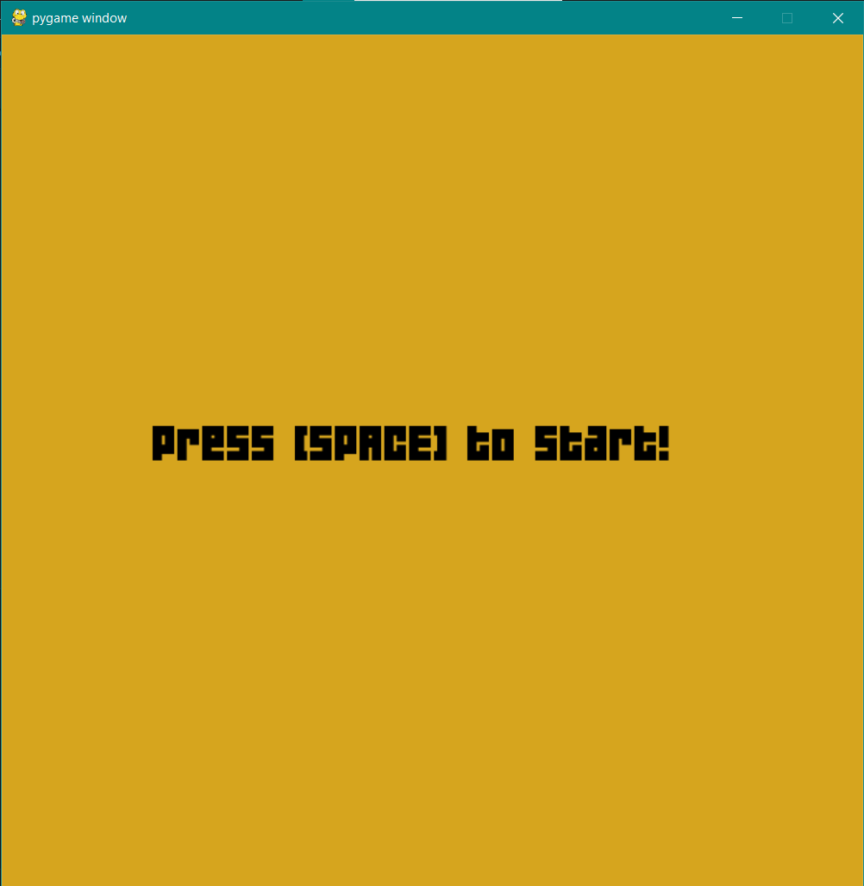

Đây là giao diện khi bắt đầu game.

#### Giao diện đặt Boom
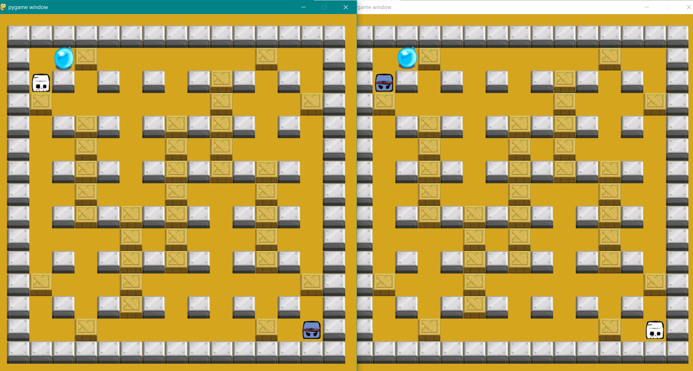

Đây là phần của trò chơi nơi người chơi có thể đặt bom tại vị trí hiện tại của họ trên bản đồ.

#### Giao diện game 2 người chơi
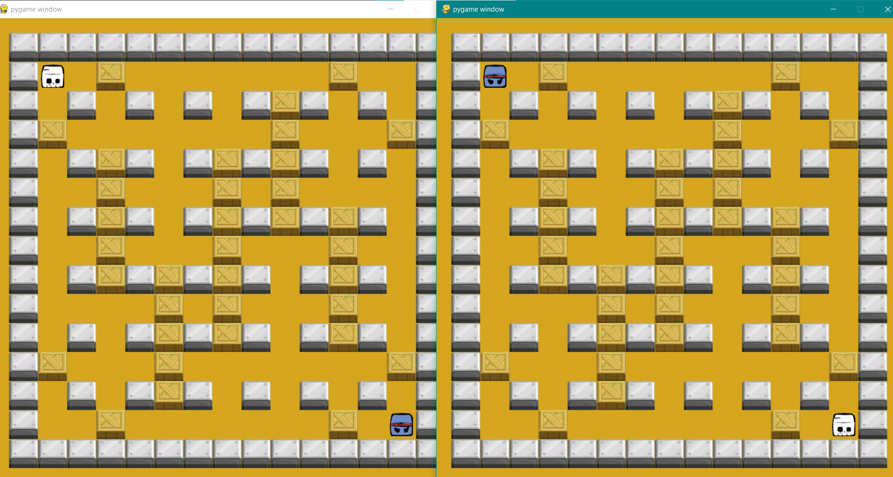

Đây là chế độ chơi của trò chơi mà hai người chơi có thể tham gia cùng một lúc và cạnh tranh với nhau.

#### Giao diện khi Boom nổ và người chơi chết
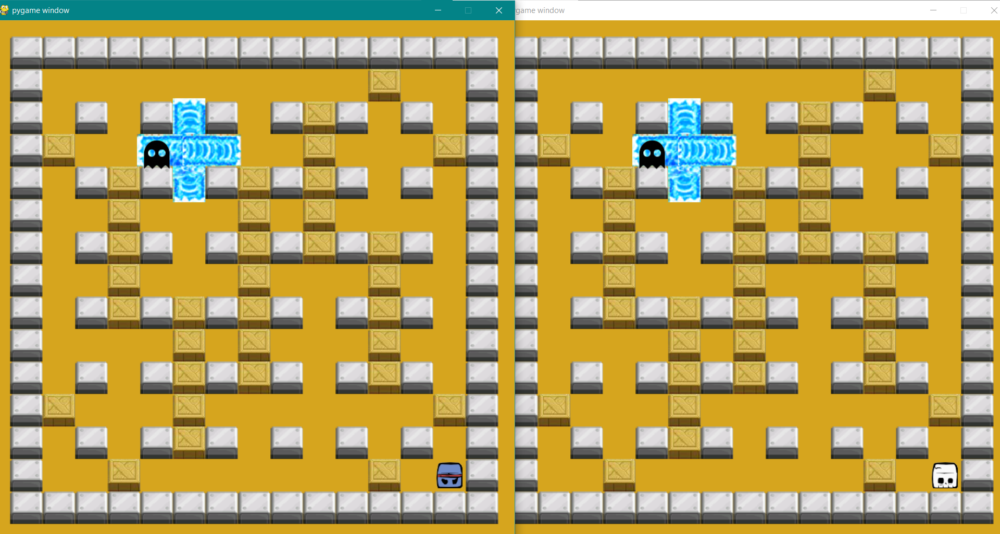

Khi bom nổ, nó có thể gây ra sự kiện người chơi chết nếu họ ở trong phạm vi tác động của nó.


## Cài đặt môi trường

Để cài đặt môi trường phát triển cho dự án này, bạn cần cài đặt Pycharm JetBrain và thiết lập Pygame như sau:

### Cài đặt Pycharm JetBrain sử dụng Toolbox App

1. **Download ToolBox App**

    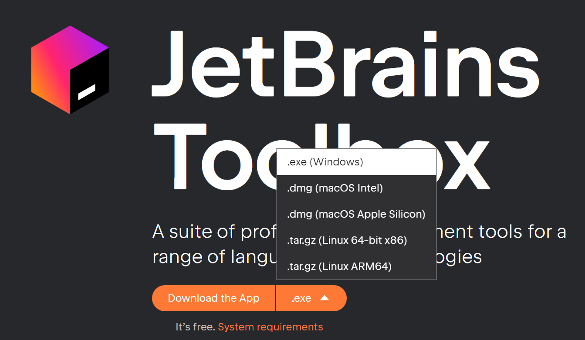

2. **Install Toolbox app**

    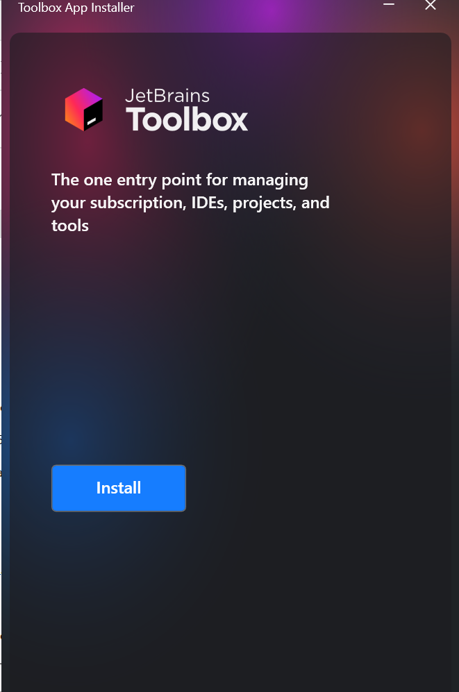

3. **Chọn phiên bản Pycharm và cài đặt**

    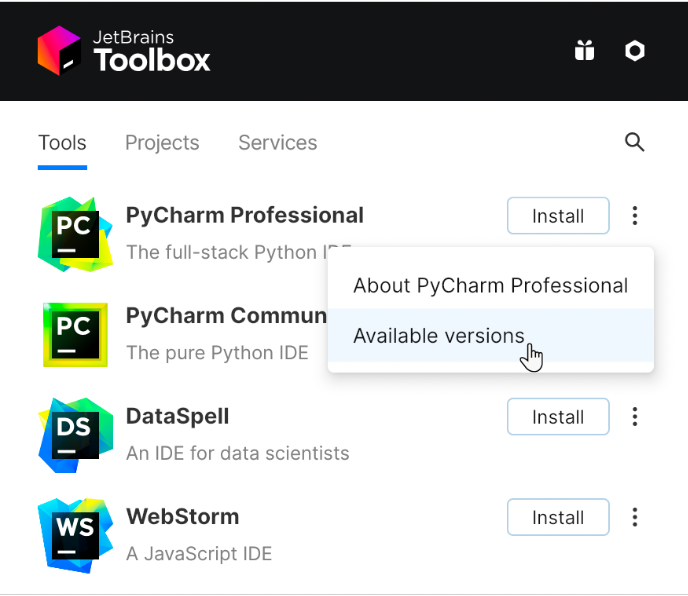

4. **Cài đặt thành công**

    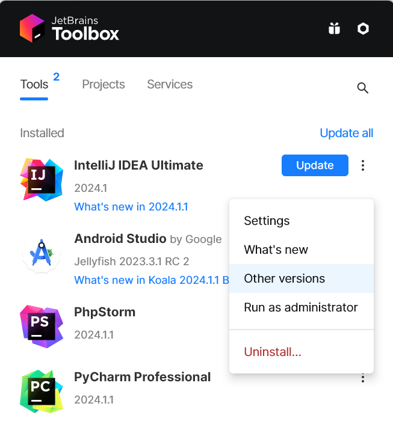

5. **Tạo project đầu tiên**

    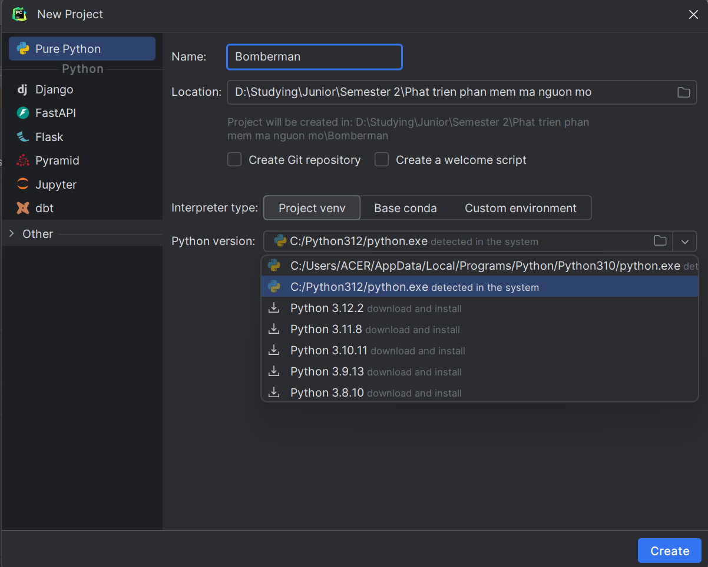

6. **Chạy main.py**

    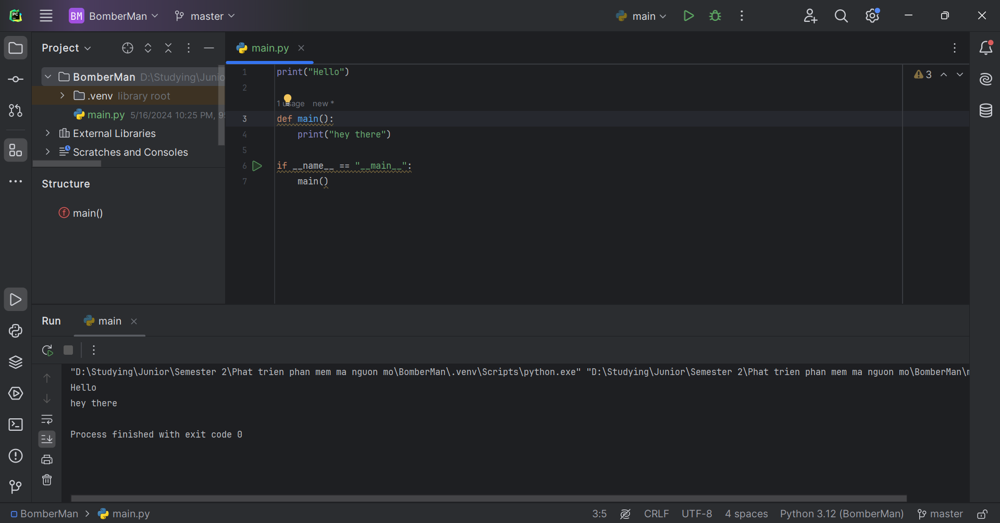

### Install package trong Pycharm

1. **Mở Python Package trên Navbar**

    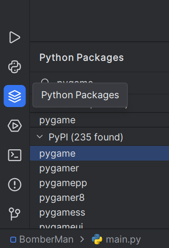

    Hoặc: Chọn "View" -> "Tool Window" -> "Python Package"

    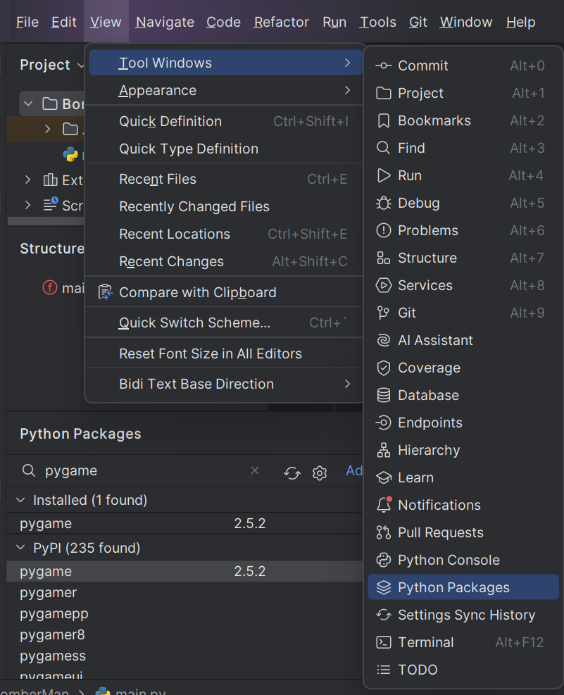

2. **Tìm kiếm và cài đặt thư viện**

    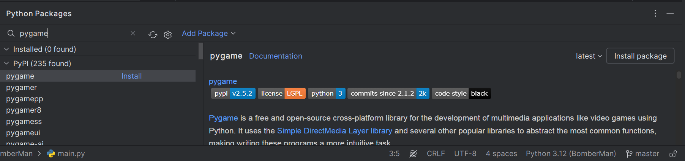

## Hướng dẫn chạy dự án

1. **Clone repository**

    ```bash
    git clone https://github.com/username/bomberman.git
    cd bomberman
    ```

2. **Cài đặt các thư viện cần thiết**

    Mở terminal trong Pycharm và chạy:

    ```bash
    pip install -r requirements.txt
    ```

3. **Chạy dự án**

    Mở Terminal và chạy `server.py`, mở terminal thứ 2 khác và chạy `client.py`, mở thêm terminal thứ 3 và chạy `client.py`

## Cấu trúc dự án

- `img_bomberman/`: Chứa các hình ảnh minh họa cho cài đặt và sử dụng.
- `src/`: Chứa mã nguồn của trò chơi.
- `README.md`: Tài liệu này.
- `requirements.txt`: Danh sách các thư viện Python cần thiết cho dự án.
- `docs/`: Chứa tài liệu liên quan đến dự án.

## Đóng góp
Chúng tôi hoan nghênh mọi đóng góp từ tất cả mọi người. Để đóng góp cho dự án này, vui lòng fork repository, tạo một branch mới cho tính năng hoặc sửa lỗi của bạn, và gửi pull request. Đảm bảo mã nguồn của bạn tuân thủ các tiêu chuẩn mã hóa của dự án và bao gồm các bài kiểm tra thích hợp.

## Tài liệu
- `docs/requirements.md`: Liệt kê các yêu cầu cài đặt và chạy dự án.
- `docs/design.md`: Mô tả thiết kế của dự án.
- `docs/contributing.md`: Hướng dẫn cho các nhà phát triển muốn đóng góp vào dự án.

## Giấy phép
Dự án này được cấp phép dưới giấy phép MIT. Xem file [LICENSE](LICENSE) để biết thêm chi tiết.

---

Cảm ơn bạn đã quan tâm đến Dự án Game Bomberman! Chúng tôi hy vọng bạn sẽ thích chơi và phát triển game này cũng như chúng tôi đã thích tạo ra nó. Chúc bạn chơi game vui vẻ!
